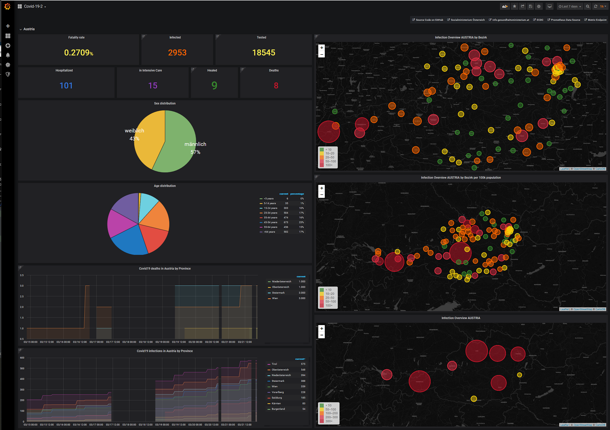

# covid19-at

This is a small go-application that parses the following URLs for statistics regarding covid19-infections and deaths
provided by the [Austrian ministry for Health](https://www.sozialministerium.at/public.html)

- https://www.sozialministerium.at/Informationen-zum-Coronavirus/Neuartiges-Coronavirus-(2019-nCov).html
- https://www.ecdc.europa.eu/en/geographical-distribution-2019-ncov-cases

It then exposes the gathered metrics as [prometheus](https://prometheus.io/) endpoint under `http://localhost:8282/metrics`

## Usage
- ```docker-compose up```
- Open [http://localhost:3000/d/2fa2-Y_Wz/cov19?orgId=1&refresh=5s](http://localhost:3000/d/2fa2-Y_Wz/cov19?orgId=1&refresh=5s) for Grafana (Credentials: admin/admin)
- Open [http://localhost:9090/](http://localhost:9090/) for Prometheus
- Open [http://localhost:8282/metrics](http://localhost:8282/metrics) for the metric exporter

## Demo Setup

- https://covid19.spiessknafl.at
- https://covid19.spiessknafl.at/prometheus
- https://covid19.spiessknafl.at/covid19/metrics

## Screenshot
